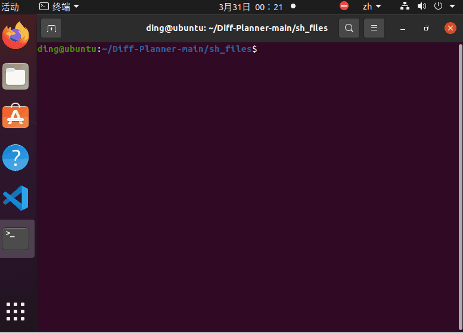
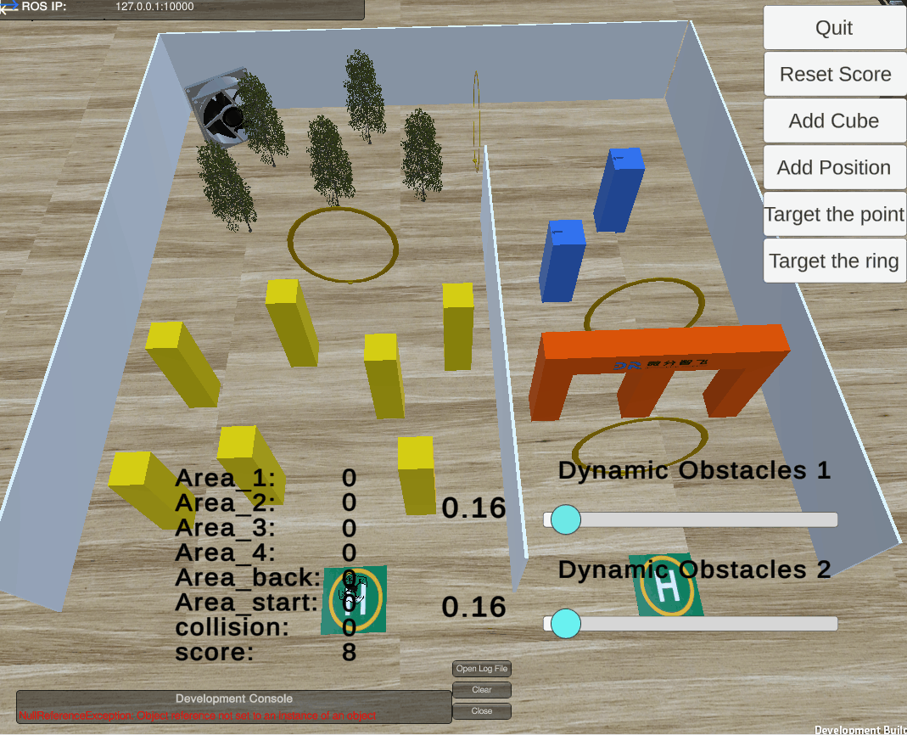
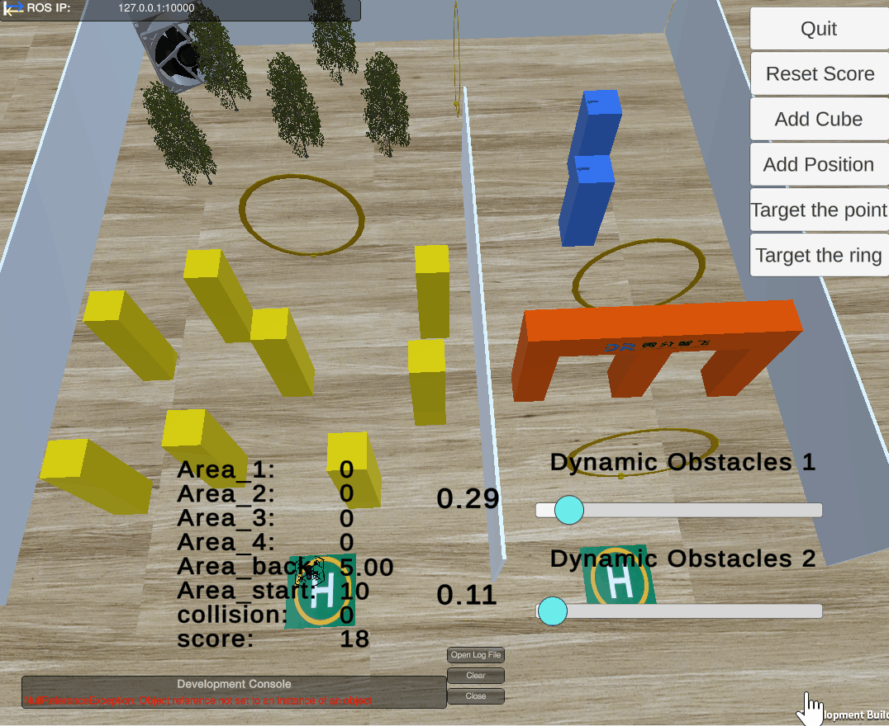
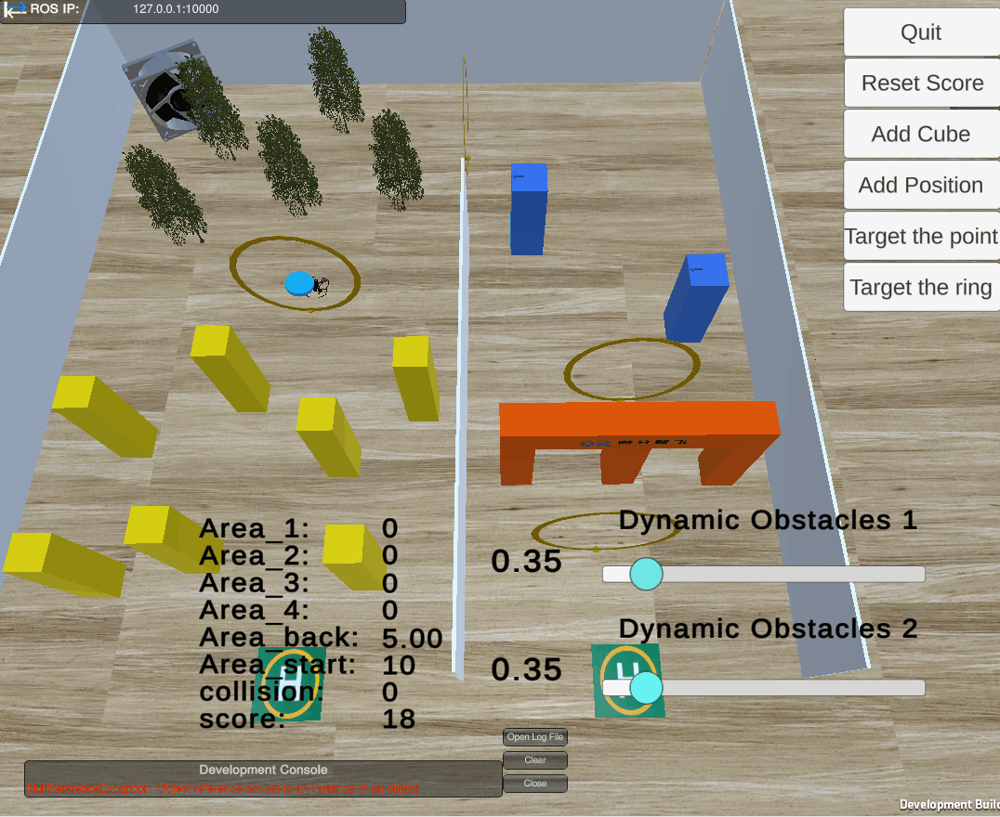
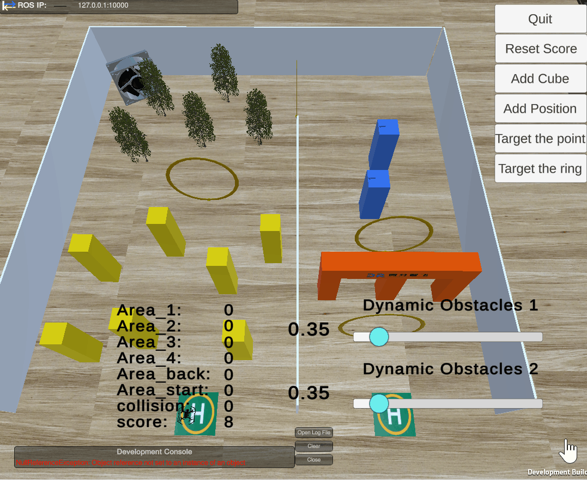
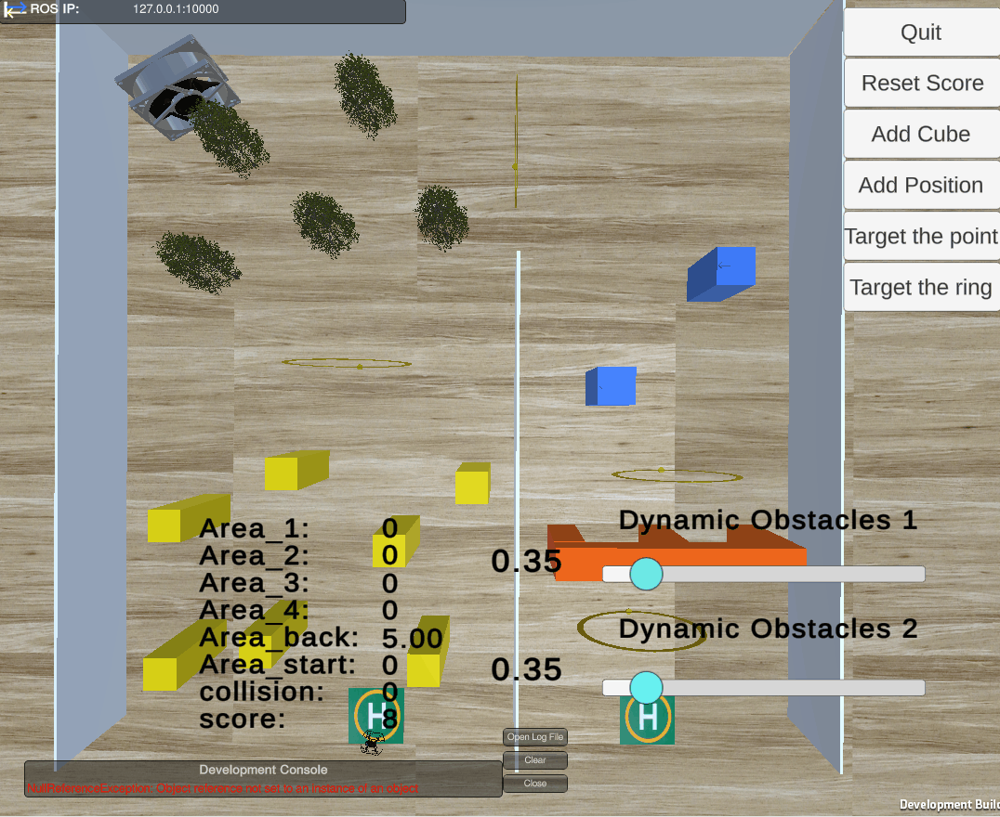

## 关于仿真器
本仿真器为**2026中国高校智能机器人创意大赛-空中具身智能挑战赛**官方提供的仿真环境，旨在为参赛队伍提供一个高保真、易用的测试平台，以便在赛前进行算法验证和场地模拟测试。该仿真器基于unity开发，复现了挑战赛中的典型环境，包括结构化障碍物区、密集树林、动态障碍、狭窄缝隙等复杂场景，帮助参赛队伍更好地适应比赛环境。同时，仿真器集成了[Diff-Planner](https://github.com/DifferentialRobotics/Diff-Planner)规划算法。

## 官方测试环境
> ros-noetic  
> ubuntu20.04  
> NVIDIA RTX4060
> INTEL I7

## 下载仿真器与示例代码
#### 示例代码下载
>+ git clone https://github.com/DifferentialRobotics/Aerial_Autonomy_Challenge.git
#### 仿真器下载
>+ https://pan.baidu.com/s/1rCioYJQSKhKqadkiC0CGdA?pwd=hs5p 
解压到Aerial_Autonomy_Challenge/src
## 快速启动
#### 编译并启动
>+ `cd Aerial_Autonomy_Challenge`  
>+ `git checkout 2026robotics`
>+ `catkin_make -j1`
>+ `cd Aerial_Autonomy_Challenge/sh_files`  
>+ `./start_all.sh`

## 仿真器界面交互  
>+ 鼠标左键控制镜头旋转
>+ 鼠标右键控制镜头平移

>+ 单击空格画面会自动调整至俯视无人机
>+ 使用右上角的'Quit'按键可直接关闭仿真器
>+ 鼠标左键点击并拖拽即可实时改变物体位置
>+ 对准不再需要的障碍物连续双击，即可将其从场景中瞬间移除。
>+ 点击界面右上角 Add Cube 按钮，系统会随机生成新的可移动障碍物，快速增加环境复杂度。

>+ 通过界面右下角的滑动条，用户可实时调节移动障碍物的速度，测试无人机在极端动态环境下的反应时间。

>+ 点击 Target the ring 后, 系统会自动将所有环按顺序发送给后台规划算法

>+ 点击 Add Position 生成球型目标点。
>+ 拖动球体到预设位置。你可以根据需求添加多个航点，构建复杂的飞行路径。
>+ 点击 Target the point 后，系统会自动将所有点位按顺序发送给后台规划算法，无人机将立即启动并按预设轨迹自动飞行。

## 仿真器ROS话题交互
#### 发布的话题：  
>+ /drone_0_pcl_render_node/cloud
#### 订阅的话题：  
>+ /quad_0/lidar_slam/odom

## 致谢与声明

本项目在开发过程中参考并使用了[MARSIM](https://github.com/hku-mars/MARSIM)项目中的部分开源功能包，特此感谢香港大学 MARS 团队的开源贡献。

相关代码均严格遵循原项目的开源许可协议使用，用户在使用本项目时，请务必遵守相应的许可证条款。

## Q&A

请随时提交问题或讨论,我们会在看到问题后尽快回复

