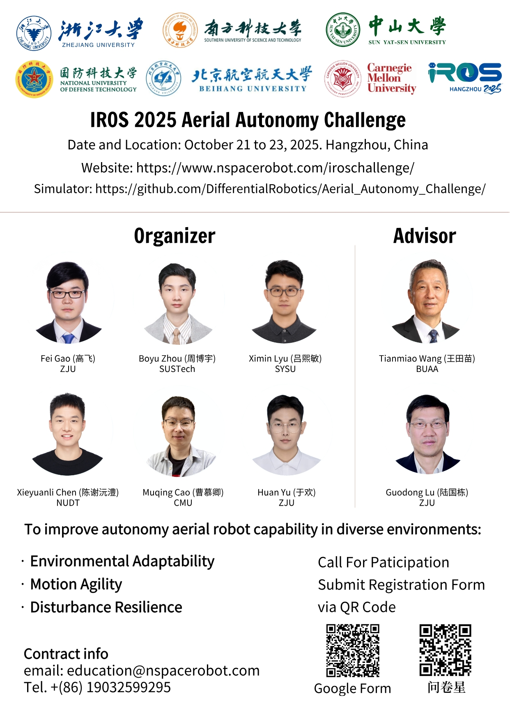

# 2025空中机器人自主挑战赛 (Aerial Autonomy Challenge)  
# 2025 IROS COMPETITION

## 概述

**IROS 2025**将于**2025年10月19日至25日**在**中国杭州**举行，全球数千名顶尖学者、技术专家和企业领袖将齐聚中国杭州，共同见证机器人技术的创新与产业发展前景。

**微分智飞**将在IROS 2025竞赛单元主办**空中自主挑战赛**（**IROS 2025 Aerial Autonomy Challenge**），旨在考察自主空中机器人在结构化地图、动态障碍、密集树林、风扰、狭窄缝隙等未知复杂环境下的自主导航能力。

本次自主空中机器人挑战赛任务设计了五个不同场景，充分考察自主无人机在真实动态环境中的定位、感知、决策、规划与控制能力。通过这些竞赛任务，深度还原行业真实需求，为空中机器人在多场景、多领域的商业化落地提供关键技术验证平台。

  

竞赛现已开放注册，我们诚邀海内外研究者与工程实践者齐聚赛场，共同促进空中机器人技术跃迁，加速空中机器人进化！

竞赛官方链接：https://www.nspacerobot.com/iroschallenge/  
Discord 讨论组：https://discord.gg/spgGRz3w
## 关于仿真器
**微分智飞**为本次比赛提供了官方仿真器，用于赛前算法验证及场地模拟测试。该仿真器真实复现了挑战赛中的典型环境，包括密集树林、动态障碍、风扰、狭窄缝隙等复杂场景。

仿真器还提供雷达点云、飞行器第一视角等接口，未来或将作为**空中自主挑战赛**预选赛平台。

## 官方测试环境
> ros-noetic  
> ubuntu20.04  
> NVIDIA RTX4060
> INTEL I7

## 下载仿真器与示例代码
#### 示例代码下载
>+ git clone https://github.com/DifferentialRobotics/Aerial_Autonomy_Challenge.git
#### 仿真器下载(请下载最新版本)
参考以下文件
[README_Simulator_CN.md](AerialAutonomyChallenge-Simulator/README_Simulator_CN.md) 或者 [README_Simulator.md](AerialAutonomyChallenge-Simulator/README_Simulator.md)

## 快速启动
#### 编译并启动Simulator-bridge
>+ `cd /path/to/AerialAutonomyChallenge-Simulator-bridge`  
>+ `catkin_make`
>+ `source devel/setup.bash`
>+ `roslaunch ros_tcp_endpoint endpoint.launch`

#### 启动Simulator
>+ `cd /path/to/AerialAutonomyChallenge-Simulator`  
>+ 双击`/path/to/AerialAutonomyChallenge-Simulator`下的`AerialAutonomyChallenge-Simulator.x86_64`

#### 编译并启动示例代码
>+ `cd /path/to/AerialAutonomyChallenge-Demo-EgoPlannerv2`  
>+ `catkin_make`
>+ `source devel/setup.bash`
>+ `roslaunch ego_planner single_drone_interactive.launch`

## 仿真器界面交互  
>+ W/A/S/D控制 镜头左右移动
>+ 按下鼠标左键控制摄像头PITCH，右键控制摄像头YAW，左右按键可同时按下
>+ 按下鼠标中键并拖动鼠标可实现W/A/S/D一样的移动效果
>+ 目前仿真器移动速度分别为：0.35m/s、0.35m/s、0.2m/s
>+ 按下键盘Esc可显示鼠标，显示鼠标状态下点击WIN键可直接右键仿真器图标关闭仿真器（或使用Alt+F4直接关闭仿真器）

## 仿真器ROS话题交互
#### 发布的话题：  
>+ /drone_0_pcl_render_node/cloud
>+ /image/compressed
#### 订阅的话题：  
>+ /quad_0/lidar_slam/odom

## 场景参数交互  
风场速调节：'[run_in_sim.xml](AerialAutonomyChallenge-Demo-EgoPlannerv2/src/planner/plan_manage/launch/include/run_in_sim.xml)'
#### 目前风速3级
>+ param name="wind_effect/strength" value="3.0"

## 致谢与声明

本项目在开发过程中参考并使用了 [EGO-Planner-v2](https://github.com/hku-mars/MARSIM) 以及 [MARSIM](https://github.com/hku-mars/MARSIM)项目中的部分开源功能包，特此感谢浙江大学 FAST-Lab 团队 与 香港大学 MARS 团队的开源贡献。

相关代码均严格遵循原项目的开源许可协议使用，用户在使用本项目时，请务必遵守相应的许可证条款。

## Q&A

请随时提交问题或讨论,我们会在看到问题后尽快回复

